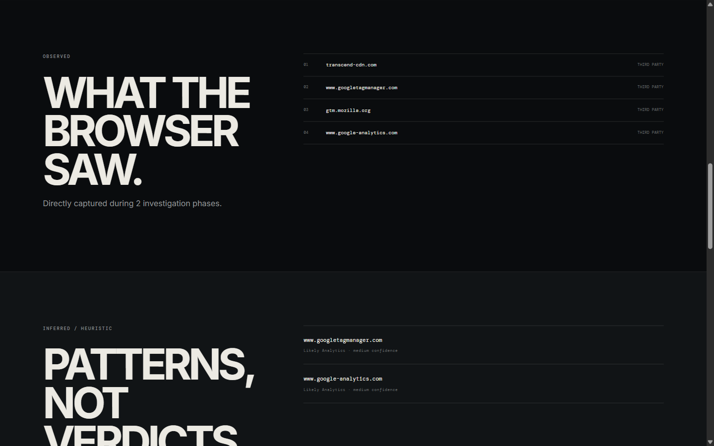

# PRISM

> **You opened one website. Your browser didn't.**

PRISM is an autonomous browser privacy investigation agent that uses a live browser session to uncover third-party connections, sensitive data flows, forms, scripts, and tracking signals as they actually occur.


## Why PRISM

Privacy analysis is often based on static source inspection, policy text, or an LLM's interpretation. Those approaches can miss what the browser actually does at runtime.

PRISM does **not** ask an LLM whether a website is risky. It:

- instruments a live browser with Webcmd;
- collects network and DOM evidence;
- decides whether deeper investigation is required;
- conditionally performs further investigation in the same session;
- scores the accumulated evidence deterministically;
- uses Gemini only to explain the finished result; and
- keeps findings pending human review.

## How it works

```text
OBSERVE
   ↓
DECIDE
   ↓
ACT (only when deeper investigation is needed)
   ↓
OBSERVE
   ↓
SCORE
   ↓
EXPLAIN
   ↓
HUMAN REVIEW
```

`ACT` is conditional. When the initial evidence is sufficient, PRISM proceeds directly from its decision to deterministic scoring instead of running a fixed interaction script.

## Example investigation

One observed run against `https://www.mozilla.org` found:

- 67 total browser requests;
- 13 third-party requests;
- 4 unique external domains;
- 1 sensitive field;
- 1 external form destination;
- heuristic tracking and analytics indicators; and
- a deterministic score of **50/100 — MEDIUM**.


Websites and their integrations change over time, so these numbers describe one observed run rather than a permanently reproducible property of Mozilla.

## Evidence-first scoring

The score is calculated from structured browser evidence. Gemini does not choose, modify, or override it.

```text
+15  Third-party domain count
+20  External form destination
 +5  Sensitive input field
+10  Heuristic tracking indicators
────
 50 / 100
```


PRISM separates two kinds of findings:

- **Observed:** browser, network, and DOM evidence captured directly during investigation.
- **Inferred / heuristic:** pattern-based classifications, such as a hostname likely belonging to an analytics service.

**Patterns, not verdicts.**



## Why the agent is actually agentic

This is not a single API call or static scanner. The controller:

1. observes the site;
2. evaluates the evidence;
3. chooses whether deeper investigation is necessary;
4. optionally acts within the existing browser session;
5. gathers additional evidence;
6. merges the observations; and
7. produces the deterministic report.

The decision policy is explicit and reproducible, making the agent's branch visible in the final report.

## Resilience and graceful degradation

If Gemini is unavailable, PRISM still returns:

- captured browser evidence;
- the deterministic score;
- the exact score breakdown; and
- the investigation decision.

Only the optional natural-language explanation is unavailable. The evidence remains valid and pending human review.

## Architecture

```text
React / Vite UI
      |
      v
Express API bridge
      |
      v
Agent Controller
      |
      +--> Webcmd live browser investigation
      |
      +--> Evidence merger
      |
      +--> Deterministic scorer
      |
      +--> Gemini explanation layer
      |
      v
Human-review report
```

The Express bridge validates the requested URL and invokes the existing controller without exposing shell execution or `GEMINI_API_KEY` to the browser.

## Built with

- **Webcmd by AgentR** — live browser-agent foundation
- Node.js
- Express
- React
- Vite
- Gemini API

## Running locally

Install dependencies:

```powershell
npm install
```

Set the Gemini key in your environment. In Windows PowerShell:

```powershell
$env:GEMINI_API_KEY="your_key_here"
```

Start the frontend and API bridge:

```powershell
npm run dev
```

Open [http://127.0.0.1:5173](http://127.0.0.1:5173).

The controller can also run directly:

```powershell
node .\agent\controller.js https://www.mozilla.org
```

Gemini is optional for the deterministic investigation and score, but required for the explanation layer.

## Demo targets

- **Primary:** `https://www.mozilla.org`
- **Backup:** `https://www.w3schools.com/html/html_forms.asp`
- **Reliability fallback:** `https://example.com`

## Important limitations

- Hostname and tracking classifications can be heuristic.
- Websites and their network behavior change over time.
- PRISM is a privacy investigation aid, not a legal or compliance verdict.
- Findings require human review before publication or consequential action.

## Repository structure

```text
agent/       Investigation controller and conditional agent loop
evidence/    Deterministic scoring and heuristic categorization
webcmd/      Live browser exploration and interaction scripts
src/         React frontend and report experience
server.js    Validated streaming API bridge
```

## License

PRISM is available under the [MIT License](LICENSE).
