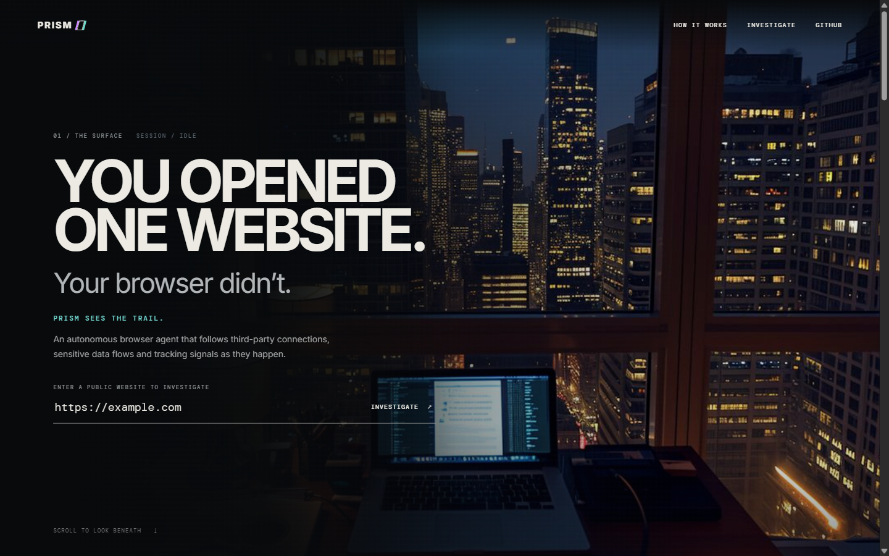
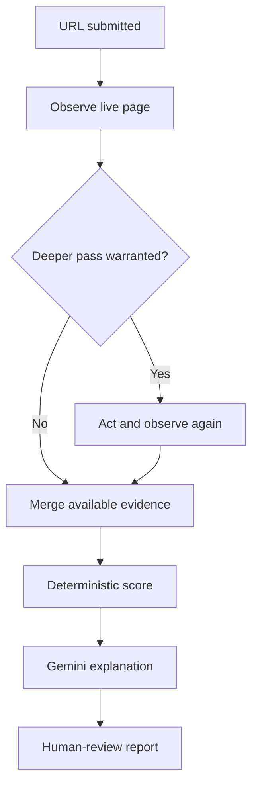
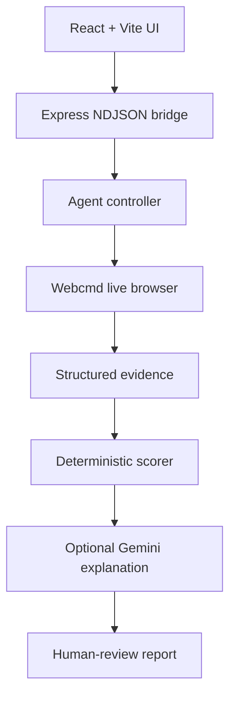
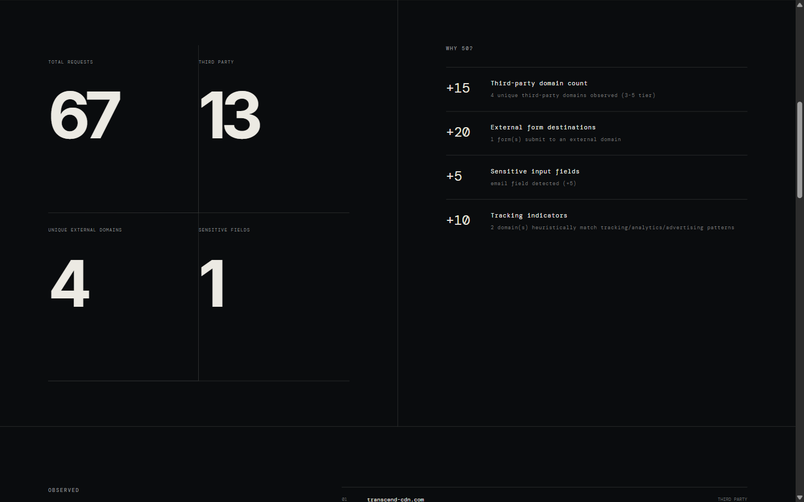
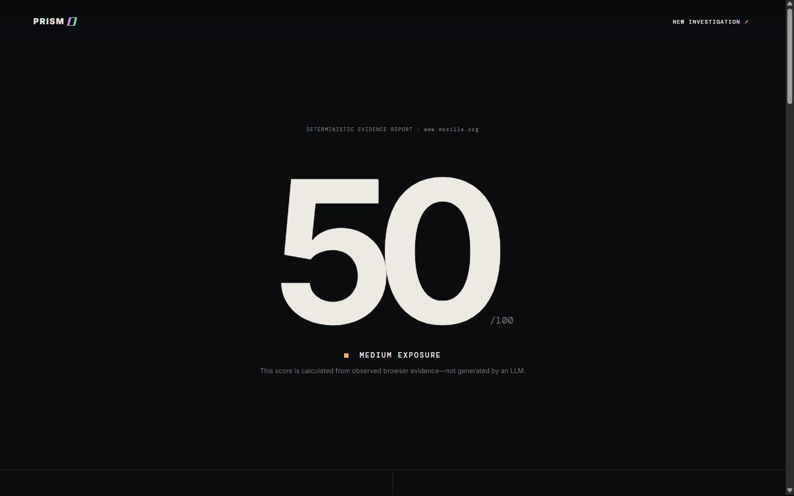

# PRISM

> **You opened one website. Your browser didn't.**

PRISM is an evidence-first browser privacy investigation agent. It opens a real website in a live [Webcmd](https://github.com/agentrhq/webcmd) browser session, observes runtime network and DOM activity, decides whether deeper inspection is warranted, and produces an explainable report for human review.



> PRISM runs locally because each investigation uses a live Webcmd browser session.

## Why PRISM

Static source inspection, privacy-policy summaries, and LLM-only assessments can miss what a browser actually does at runtime. PRISM instead:

- instruments a live browser through Webcmd;
- captures structured network, form, input, and script evidence;
- makes a visible, deterministic decision about deeper inspection;
- continues in the same browser session when a second pass is justified;
- calculates the risk score with a reproducible rubric;
- uses Gemini only to explain the completed score; and
- labels findings as observed or heuristic and keeps them pending human review.

PRISM reports **patterns, not verdicts**. Third-party activity is not automatically described as a leak, and hostname-based categories are explicitly presented as heuristic.

## Investigation flow



The conditional branch is based on explicit evidence such as an external form destination, a third-party domain count near a scoring boundary, or sensitive fields appearing alongside third-party activity.

## Architecture



The Express bridge validates the requested URL, streams investigation phases to the frontend, and launches the controller without exposing `GEMINI_API_KEY` to the browser.

## Evidence-first scoring

Gemini never chooses, modifies, or overrides the score. The deterministic rubric considers:

| Component | Points |
| --- | ---: |
| Unique third-party domains | 0–35 |
| External form destinations | 0 or 20 |
| Sensitive input types | 0–30, capped |
| Heuristic tracking indicators | 0–20 |
| Final score | Capped at 100 |

Risk levels are `LOW` (0–29), `MEDIUM` (30–59), `HIGH` (60–79), and `CRITICAL` (80–100). Every awarded component includes an exact reason in the report.



## Example investigation

One observed run against `https://www.mozilla.org` found:

- 67 total browser requests;
- 13 third-party requests;
- 4 unique third-party domains;
- 1 sensitive field;
- 1 external form destination;
- heuristic tracking and analytics indicators; and
- a deterministic score of **50/100 — MEDIUM**.



Websites and their integrations change, so these figures describe one captured run rather than a permanent property of Mozilla.

## Run PRISM locally

### Prerequisites

- Windows, macOS, or Linux
- Node.js 24 recommended
- npm
- internet access for the target website
- a Gemini API key only if the explanation layer is desired

### 1. Clone and install

```powershell
git clone https://github.com/6289subhasree/prism-agent.git
cd prism-agent
npm install
```

Webcmd `0.7.8` is pinned as a project dependency; a separate global installation is not required.

### 2. Configure Gemini (optional)

Create a `.env` file in the repository root:

```dotenv
GEMINI_API_KEY=your_api_key_here
```

The file is local-only and must not be committed. Without a key, the investigation and score still work; the report simply omits the Gemini explanation.

### 3. Verify the browser runtime

```powershell
npm run prism:doctor
```

Do not begin a live demo until the command ends with:

```text
PASS: PRISM Webcmd preflight completed successfully.
```

### 4. Run the application

```powershell
npm run dev
```

Open [http://127.0.0.1:5173](http://127.0.0.1:5173), enter a public HTTP(S) URL, and start the investigation.

### 5. Run tests

```powershell
npm test
npm run build
```

The controller can also run without the frontend:

```powershell
node .\agent\controller.js https://example.com
```

## Demo targets

| Purpose | URL |
| --- | --- |
| Primary evidence-rich demo | `https://www.mozilla.org` |
| Forms-focused backup | `https://www.w3schools.com/html/html_forms.asp` |
| Reliability fallback | `https://example.com` |

Use `https://example.com` first when validating a new environment.

## Troubleshooting

### `npm run prism:doctor` is missing

Make sure the repository is up to date and reinstall its dependencies:

```powershell
git pull
npm install
```

### Webcmd reports `EPERM` inside `.webcmd`

A stale Webcmd daemon may be holding its session file. Identify the relevant process before stopping anything:

```powershell
Get-CimInstance Win32_Process |
Where-Object { $_.CommandLine -match '@agentrhq\\webcmd.*daemon' } |
Select-Object ProcessId, ExecutablePath, CommandLine
```

Stop only the confirmed Webcmd daemon, then rerun the preflight:

```powershell
Stop-Process -Id <WEBCMD_DAEMON_PID> -Force
npm run prism:doctor
```

Do not terminate unrelated Node processes such as an active Codex session.

### Investigation succeeds but Gemini is unavailable

Confirm that the root `.env` contains `GEMINI_API_KEY`, restart `npm run dev`, and investigate again. The deterministic report remains valid without Gemini.

## Repository structure

```text
agent/       Controller, conditional investigation loop, and tests
evidence/    Deterministic scoring and heuristic categorization
scripts/     Environment and Webcmd preflight
webcmd/      Live-browser exploration and interaction scripts
src/         React report interface
server.js    Validated streaming API bridge
```

## Built with

- [Webcmd by AgentR](https://github.com/agentrhq/webcmd) — live browser and session foundation
- Node.js and Express
- React and Vite
- Gemini API — constrained explanation layer only

## Limitations

- Live investigations require a machine that can run the Webcmd browser daemon.
- Websites and their runtime integrations may change between runs.
- Domain classifications are heuristic and do not prove tracking or misuse.
- PRISM is an investigation aid, not a legal, compliance, or breach verdict.
- Reports require human review before publication or consequential action.

## License

PRISM is available under the [MIT License](LICENSE).

## Consent inspection

PRISM reads visible cookie-banner controls during the initial browser session and shows their labels in the report. Accept, reject, and settings actions are inferred from explicit English labels; ambiguous labels stay unknown. It does not click controls or compare acceptance and rejection yet. Iframes and shadow DOM are outside this inspection. A missing banner is reported as not observed, not as proof of compliance.
